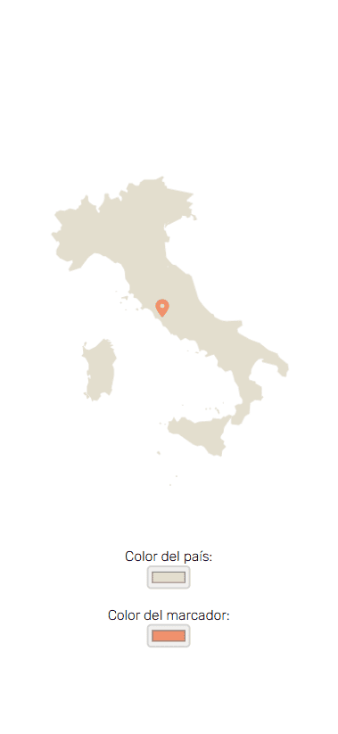

# Prueba técnica para 51Trips - Mostrar mapa

Este proyecto consiste en la visualización de un mapa que utiliza React y la librería Leaflet. En este caso el mapa elegido ha sido Italia y el punto geolocalizado es Roma. El usuario también puede interactuar con el mapa cambiando el color del país y el color del marcador, lo que se refleja dinámicamente en la interfaz.



## Tecnologías Utilizadas

- **React**: Librería de JavaScript para construir la interfaz de usuario.
- **Leaflet**: Biblioteca de código abierto para mapas interactivos.
- **React-Leaflet**: Integración de Leaflet con React.
- **CSS (con clases personalizadas)**: Estilos básicos para el mapa y los controles.
- **Fetch API**: Para obtener los datos GeoJSON de un país.

## Funcionalidades

- **Cargar un mapa centrado en Italia**: El mapa muestra un GeoJSON con las fronteras de Italia.
- **Colores personalizables**: Los usuarios pueden cambiar el color de las fronteras del país y del marcador del mapa.
- **Responsive**: El diseño se adapta a diferentes tamaños de pantalla utilizando media queries en CSS.

## Instrucciones de Instalación

Para ejecutar este proyecto en tu máquina local, sigue estos pasos:

1. Clona este repositorio:

   ```bash
   git clone https://github.com/srdgz/51trips-pt
   cd 51trips-pt

   ```

2. Instala las dependencias del proyecto:

   ```bash
   npm install

   ```

3. Inicia la aplicación:

   ```bash
   npm run dev

   ```
